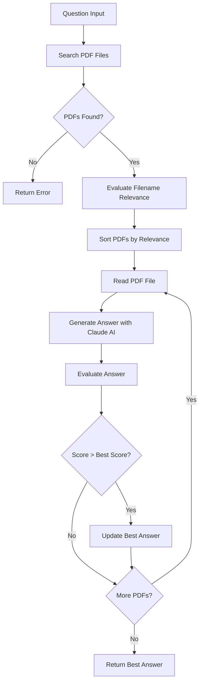

# Local PDF Agent

An MCP server that answers questions about PDF files with citations using Claude AI.

## Setup

Create a `.env` file with the following content:
```bash
ANTHROPIC_API_KEY=your-api-key-here
PDF_FOLDER_PATH=/path/to/your/pdf/folder
```

## Starting the MCP Server

### Configure MCP server:
Add the following configuration to your `claude_desktop_config.json`:
```json
{
  "mcpServers": {
    "LocalPDFAgent": {
      "command": "/path/to/uv",
      "args": [
        "--directory",
        "/path/to/local-pdf-agent",
        "run",
        "--env-file",
        ".env",
        "mcp",
        "run",
        "tool.py"
      ]
    }
  }
}
```

### Start the dev server:
```bash
uv run --env-file .env mcp dev tool.py
```

To start the MCP server, add the configuration to your `claude_desktop_config.json` file and then run the server using the provided command. Once the server is running, you can send questions from Claude.

## Workflow Design



The workflow operates in the following steps:

1. Receive a question from the user
2. Search for PDF files in the specified folder
3. Evaluate relevance between filenames and the question
4. Process PDFs in order of relevance:
   - Read PDF file content
   - Generate answer using Claude AI
   - Evaluate answer quality
   - Update if a better answer is found
5. Return the highest quality answer

## Usage

Once the MCP server is running, you can ask questions through Claude using:

```python
local_pdf_citation("Your question about the PDF content here")
```

The server will return:
- Answer with citations
- Answer evaluation (quality score, reasoning, potential improvements)
- Source PDF file path

Citations are displayed in the format: `[Citation: cited text (Document Name(index))]`